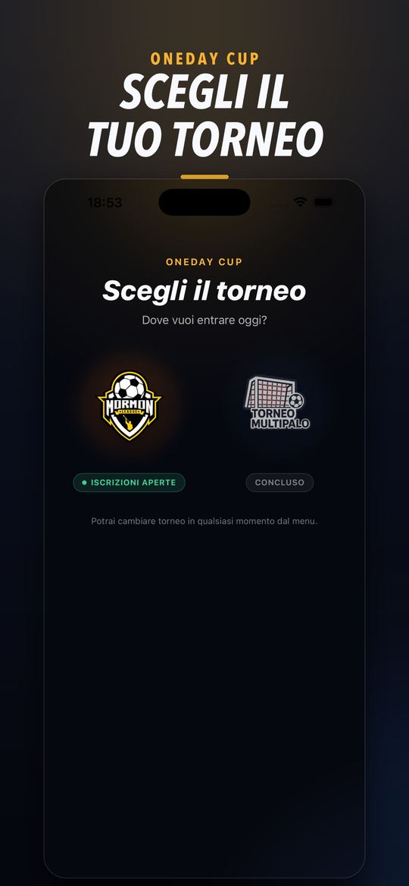
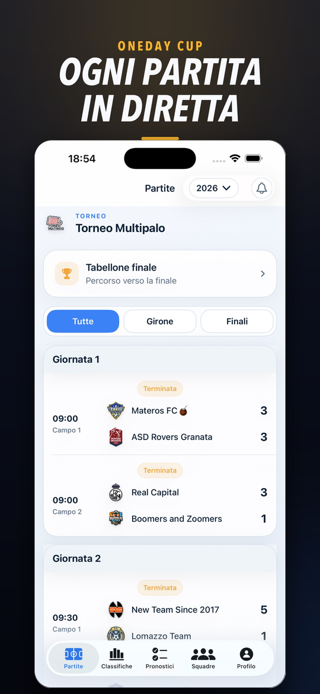
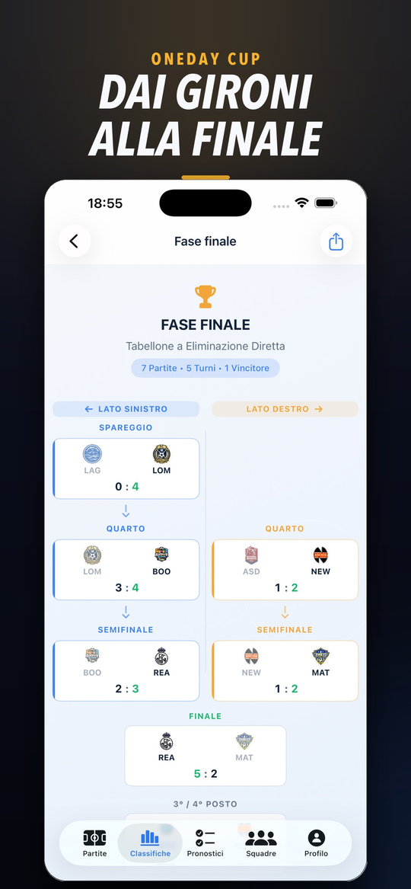

# One Day Cup (iOS)

App nativa per tornei di calcio che si giocano in un giorno solo: gironi, partite
in parallelo, marcatori, classifiche e premi, aggiornati in tempo reale mentre il
torneo è in corso. Nata come "Torneo Multipalo" (il nome è rimasto nel bundle e
nei sorgenti), oggi gestisce più tornei con edizioni separate.

- Sull'App Store dal 14 aprile 2026: [One Day Cup](https://apps.apple.com/app/one-day-cup/id6761762177)
- Sito e web app con lo stesso backend: [onedaycup.it](https://onedaycup.it)

## Screenshot

| | | |
|---|---|---|
|  |  |  |

## Cosa fa

- **Pubblico**: calendario, partite live, classifiche dei gironi e dei marcatori,
  tabellone a eliminazione, premi.
- **Giocatori e responsabili squadra**: registrazione, rosa, figurina personale con
  statistiche di carriera, trasferimenti.
- **Admin del torneo**: gestione della partita in diretta (gol, portieri, rigori,
  staff), sorteggi, premi, notifiche.
- **Live Activity e Dynamic Island** con il punteggio della partita seguita
  (`MatchLiveActivity/`).
- **Push con lo stemma della squadra**, tramite una Notification Service Extension
  (`NotificaConStemma/`).

## Stack

SwiftUI, iOS 17, `@Observable`, async/await. Firebase Firestore (ascolto realtime),
Auth con Sign in with Apple e Google, Cloud Functions, Storage, Messaging.
ActivityKit, WidgetKit, UserNotifications, PDFKit. Dipendenze via Swift Package
Manager (Firebase iOS SDK 12.10, GoogleSignIn).

```
Torneo Multipalo/
  App/          bootstrap, Firebase, sicurezza a runtime
  Models/       torneo, edizione, squadra, giocatore, partita, classifica, premi
  Services/     Firestore, Auth, Functions, Storage, classifiche, portieri, rigori,
                figurine, Live Activity, notifiche
  Navigation/   tab e route per ruolo
  Views/        Public, Player, TeamOwner, Admin, Auth, Settings, Shared
MatchLiveActivity/    estensione Live Activity
NotificaConStemma/    Notification Service Extension
Tests/                test della logica (vedi sotto)
```

## Test

La logica di gioco (classifiche, assegnazione automatica dei portieri, struttura
del torneo, premi, compatibilità con i dati delle prime edizioni) è compilata anche
come pacchetto SwiftPM, `TorneoMultipaloLogic`, e si testa sul Mac senza aprire il
simulatore:

```bash
swift test
```

32 test XCTest in `Tests/TorneoMultipaloLogicTests`.

## Build

`GoogleService-Info.plist` e `GoogleService-Info-Staging.plist` non sono nel repo:
vanno in `Torneo Multipalo/` prima di aprire `Torneo Multipalo.xcodeproj`
(schema `Torneo Multipalo`). Le push richiedono un profilo con l'entitlement
`aps-environment`.

Il codice è in italiano, come il torneo.
